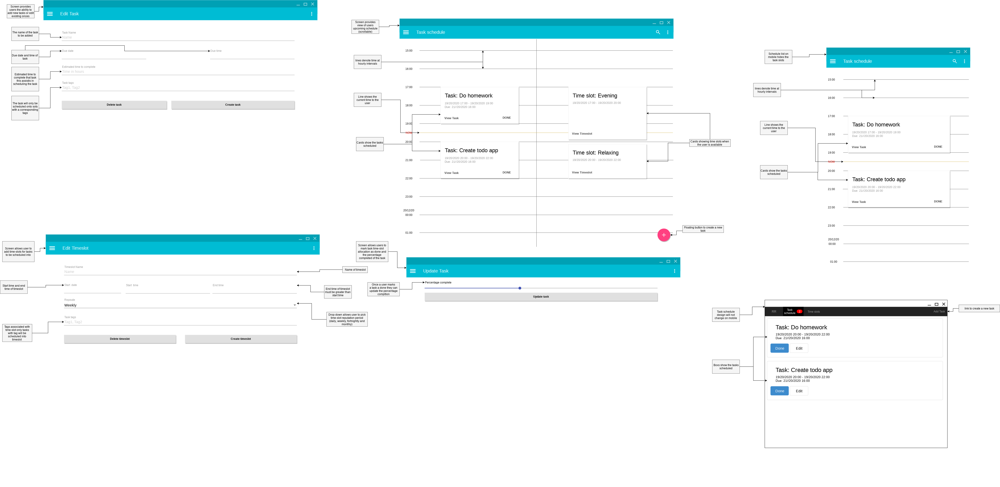
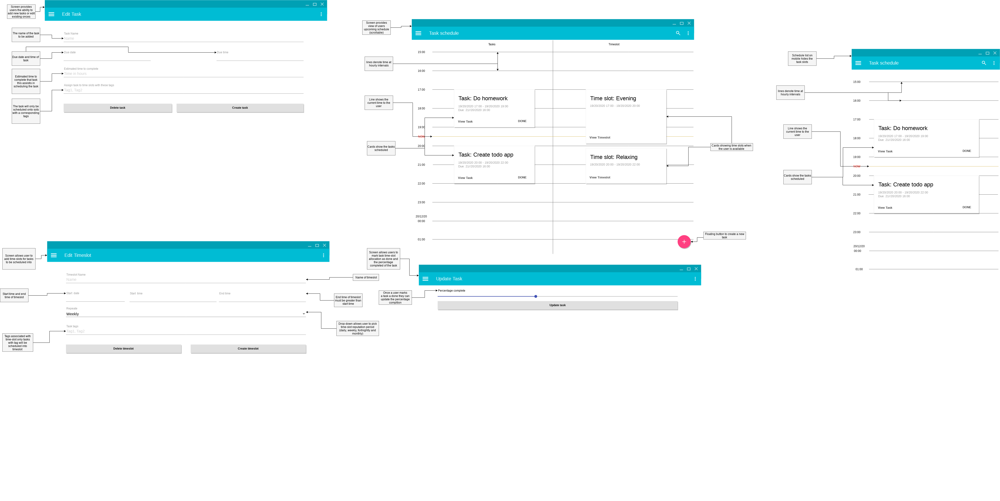

# Rodgers reminders

rodgers reminders is a paid for by subscription reminders application with auto-scaling functionality. The application is able to remind users when they need to perform certain actions based on the time of day. These reminders are automatically scheduled based on when the user is free and the length, priority, type and deadline of the task.

## Table of contents

<!-- TOC -->

- [Rodgers reminders](#rodgers-reminders)
    - [Table of contents](#table-of-contents)
    - [The needs of Rodgers reminders](#the-needs-of-rodgers-reminders)
    - [Preparing for the project.](#preparing-for-the-project)
        - [Policy](#policy)
            - [Policy 1: Document decisions / actions](#policy-1-document-decisions--actions)
            - [Policy 2: Mean well](#policy-2-mean-well)
            - [Policy 3: Being open](#policy-3-being-open)
        - [Staff overview](#staff-overview)
    - [Threats to the project](#threats-to-the-project)
        - [Risks](#risks)
            - [Budget](#budget)
                - [The risk](#the-risk)
                - [The fix](#the-fix)
            - [Deadlines](#deadlines)
                - [The risk](#the-risk-1)
                - [The fix](#the-fix-1)
            - [Stakeholders](#stakeholders)
                - [The problem](#the-problem)
                - [The fix](#the-fix-2)
            - [Staff ability](#staff-ability)
                - [The problem](#the-problem-1)
                - [The fix](#the-fix-3)
            - [No market for the product](#no-market-for-the-product)
                - [The problem](#the-problem-2)
                - [The fix](#the-fix-4)
    - [Project boundaries](#project-boundaries)
    - [Project scope](#project-scope)
        - [Target audience](#target-audience)
        - [functionality](#functionality)
        - [Platform](#platform)
    - [Inputs, outputs process and storage](#inputs-outputs-process-and-storage)
        - [inputs](#inputs)
        - [outputs](#outputs)
        - [processes](#processes)
        - [storage](#storage)
    - [Designs](#designs)
        - [Design questions](#design-questions)
        - [Design responses](#design-responses)
            - [Kerri Swindells (Operations manager at small charity) 01/01/2018](#kerri-swindells-operations-manager-at-small-charity-01012018)
            - [Ryan Binns (Head of IT and Development at a large company) 06/01/2018](#ryan-binns-head-of-it-and-development-at-a-large-company-06012018)
            - [Carroal Campbell (Retirered) 01/01/2018](#carroal-campbell-retirered-01012018)
        - [Design improvments](#design-improvments)
    - [Applications requirements](#applications-requirements)
    - [Entertys and relationships](#entertys-and-relationships)
        - [Users](#users)
        - [Tasks](#tasks)
        - [Availability times](#availability-times)
    - [Processes](#processes)
    - [Testing](#testing)
        - [Live user testing](#live-user-testing)
        - [Unit testing](#unit-testing)
        - [Intergation testing](#intergation-testing)
        - [Scale testing](#scale-testing)
    - [Maintenance](#maintenance)
- [Review](#review)
    - [Feedback](#feedback)
    - [Responce](#responce)

<!-- /TOC -->

## The needs of Rodgers reminders

The service that Rodgers reminders organisation aims to provide is to create a reminders application that will remind. To do this they will need to develop a reminders application. This application will be the Namesake of the organisation, Rodgers reminders.
This reminders application will be aimed at English speaking customers in the US and UK, this is due to the development team only consisting of English speaking staff, limiting their ability to develop for other countries.

The development team consists of 3 part-time freelance staff members. These staff member located around the world and are highly mobile, meaning they are often not in one location all the time, because of this they all work on laptop computers. The staff members are able to communicate and collaborate over the internet.

## Preparing for the project.

### Policy
Before the development of the project commences a number of steps need to be taken. The first of these is to create a number of policies and procedures that define how the organisation is run and behaves. Due to the small size of the team and the project, these policies will be brief and bullet-pointed.

#### Policy 1: Document decisions / actions

Any decision that is made that effects the organisation in a meaning full way must be documented. This documentation must include 3 parts.

1. The reason a decision had to be made.
2. The options available include for each
  - what the option is
  - the pros of choosing the option
  - the cons of choosing the option
3. The option finally is chosen
4. Why the option was chosen.

#### Policy 2: Mean well

Any action taken by the organisation or staff members should be done to mean well and without malicious intent, because of this staff members must assume that the actions of another staff members are not taken with a malicious intent towards them or anyone else. If the actions of the organisation or staff member do cause offence to another individual the problem should be solved with reasonable facts based discussion. 

#### Policy 3: Being open

The organisation aims to be open both internally and externally. This means that any decisions or opinions of staff members should be freely expressed and documented. This, however, should be done in accordance with policy number 2. 

This policy also means that any research conducted by the organisation should be as open as possible. There are however exceptions to this rule, for example, any personal or private details collected should be held securely, for as little time as possible and in compliance with appropriate laws and regulations.

### Staff overview

There are 3 staff members on the team. Each staff member has an equal stake in the organisation and is paid the same rate of £20 per hour.

## Threats to the project

There are a number of threats and risks that the project will be subject that could affect its progress of success. It is important to outline these threats and risks in order to make decisions to minimise their likelihood of happening.

### Risks
There are a number of risks the project is subject to.

#### Budget
##### The risk
The budget of the project could be a risk to its completion. A bank has loaned £100k to the team to create the application. With the largest cost of the project being the developers time. The most likely cause of the project running over budget will be missing deadlines. There is a possibility of getting a larger loan to complete the project but this will substantially increase the companies debt that is already quite substantial. 
##### The fix
The projected does not have any deadlines however one is created by the budget and the developers' wages. In order to avoid missing this deadline, a pseudo-deadline should be created before it to create a buffer allowing for run overs.

#### Deadlines
##### The risk
Missing deadlines could put the project over budget and mean the organisation runs out of funds.
##### The fix
In order to prevent this deadline will be set before they need to be to allow for run over. The project will also be using agile development so that after each sprint a working product will be produced.  This means the development process can be stopped here and resumed at a later date when more funds are available.

#### Stakeholders
##### The problem
As the project is developer leed with no external stakeholders other than the bank. If the development team is not motivated to complete the project or keep changing the requirements of the project, then this could lead to project failure.
##### The fix
As the organisation consists of 3 members any decision can be made by a majority. If a majority decision is made, even if this decision is to stop the project then this decision is the correct one.

#### Staff ability
##### The problem
Not all staff members perform equally, however as the team consists of only 3 developers it is down to each individual staff member to perform well. 

##### The fix
If a staff member does not perform well then they can be removed from the team with a majority vote, or if a staff member does not feel the other two staff members are performing well enough they can leave the project, as it will not able to succeed with them not performing well.

#### No market for the product
##### The problem
Because the application is being developed without a contract or direct client, there is a risk that there will be none or not enough users pay to use the product to fund the development.
##### The fix
Before development starts on the product market research should be conducted and potential users interviewed to see if they wish to buy the proposed product.

## Project boundaries

## Project scope
The scope of the project taking into account any of the risks and constraints are as follows

### Target audience 
The application will only be developed for English speaking users. This is because the development team is only English and can not predict the needs of any none English speaking individuals and cultures, such as the difference between polychronic and monochronic cultures and how they manage time.

### functionality 
The application will aim to be a simple reminders application with the auto-scheduling ability being its unique selling point. The applications capabilities can be expanded upon at a later date, however, the initial scope will only include this functionality to keep time down and thrust stay within budget

### Platform
The application will only be made to support the web and will be developed as a progressive web app (PWA). The reason for developing the application in this to maximise the number of users it will be available to while reducing the amount of development work. By developing a PWA, developers will able to use many functionalities previously only available to Native applications, such as push notifications and offline support.

## Inputs, outputs process and storage

### inputs

The application will take a number of inputs in order to perform the function of reminding users of tasks they need to complete and scheduling these tasks.

- tasks the users need to complete and associated data
  - the deadline that the task is due to be completed
  - the estimated time to complete the task so it can be scheduled into the users free time
  - the total percentage the task is completed so an estimated time remaining can be calculated
  - the amount of time that the task has been worked on.
  - the type of task the task is so that it can be allocated to appropriate time slots
- availability times slots (when the user is available to complete tasks) and their associated data
  - the types of tasks that can be performed in this time slot
  - the start time of the availability slot
  - the amount of time that is available at this time slot
  - should the time slow be repeated is so how often (weekly, daily?, excluding set time)

### outputs

- the information time slots that the user has added to the system
  - the name of the timeslot
  - the tasks that have been scheduled for the time slots
  - how often the time slots repeat
- the time that tasks have been scheduled for the user to complete

### processes

- break tasks down into chunks and allocate them to appropriate time slots
 - making sure that the task can be completed before the deadline

### storage

- the time slots that have been entered by the users and their associated data
- the tasks entered by the user and their associated data
- the time slot allocations tasks have been scheduled into time slots (to save on recomputing every time the application is used)

## Designs
From the defined inputs, outputs, process and storage, user interface designs can be produced.

I decided to produce two different user interface designs. Both use existing UI languages in order to save time and speed up the development of the project. It also provides a simple way for creating designs that will be visually appealing. The first main set of designs are done using the material design language by Google. This is a UI language that attempts to emulate the properties of material most specifically paper, giving it the ability to create experiences that relate to real-world interactions people will have with there surroundings. 

The alternative design is using the Bootstrap UI framework. This is a popular web framework that provides a quick way to develop intuitive applications for users.

### Design questions
A small questionnaire was given to a number of people ranging in technical ability. From people who rarely using a computer or smartphone to developers who create similar applications.

Design 1:

1. Does the design feel familiar
2. Where are timeslots slots show?
3. Where are tasks displayed?
4. What button would you press to add a new task?
5. What information is required to create a task?
6. Does the design look visually appealing?
7. Does the look of the design make the effect the intuitiveness of the design?
Design 2:

8. Would you prefer this design to design 1?

Overall:

9. Would you use this application?

### Design responses
The following responses were done in person a number of differing dates. I chose to ask the questions in person as I am able to better gauge the response of the response through body language and time took to respond. The feedback from these responses will be used to create a 2nd iteration of the prefered design.

#### Kerri Swindells (Operations manager at small charity) 01/01/2018

1. Yes, this design does feel familiar it looks like the one used on my phone.
2. Time slots are shown on the right-hand side of the overview page. It was not very obvious though. 
3. Tasks are shown on the left-hand side next to the time slots.
4. The plus button I think, as this is the main thing you would want to do. However, it could be on the menu that is accessed by the 3 lines on the top.
5. The task name, when I want to start doing the task, when it needs to be done by, how long I think it will take to complete and its tags. I am not sure what tags are, however?
6. Yes, I quite like it. it's clean and simple.
7. Yes, I like how I don't have to learn something new, it's just like my phone.
8. No, this design looks more ugly and old.
9. Yes definitely, I find it had to schedule things I need to get done. Time just runs away from me sometimes.

Kerri liked the design and felt it looked a lot like her phone, this will be because her android phones use the material design language, she says this common design language helped her understand how the designs of the application.

She noted that she found it hard to differentiate between the tasks and the timeslots. This could be improved by adding a header above each collum. They said that pressing the button was the way to add a new task however, they also said it may be in the mobile navigation. Because of this, I shall put the action in both places.

When creating a task she was able to understand the data that needed to be filled in, however, she did not understand what tags were for. It should help to provide a note explaining there use. 

She did not like alternative design describing it as old and ugly.

#### Ryan Binns (Head of IT and Development at a large company) 06/01/2018

1. The design does feel familiar, It is material design by Google, we use it internally. I definitely prefer applications that use it.
2. Yep, they are on the right-hand side of the overview screen.
3. Tasks are on the left side.
4. I assume pressing the FAB will create a new task.
5. The dates between I want to complete the task, Its name, an estimated time and tags. I assume the tags are used to allocate tasks to time slots but how?
6. I really do like Material Design, I wished more applications using it.
7. It follows the material design guidelines so yes, The design language is very thought through and makes applications very intuitive to use.
8. No, I definitely prefer design 1. I am not a fan of bootstrap.
9. Yes, I use Jira at work but would love an application like it for personal use.

Ryan liked the use of material design and specifically stated he prefered applications that use it. He also said it was his design language of choice when he creates applications. 
He found it easy to understand how to use the application including finding out how to create a new task and where tasks and times slots are located on the overview screen. He did wonder how the tag system works. There is no explanation of how this system works and is something that needs to be improved.

He definitely did not prefer the alternative bootstrap design.

He would use the application for personal use as it functions much like Jira, the tool he uses to manage tasks at work.

#### Carroal Campbell (Retirered) 01/01/2018

1. I'm not sure. I don't really use my tablet much, so don't know.
2. I don't really know.
3. No
4. The big red button?
5. When I want it done by and what the task is?
6. I don't really know.
7. No, but then again I can never figure out how to use my tablet
8. Yes the list is more simple
9. No, I like to put things I want to do in my diary.

Carroll does not use technology much in her daily life so she is not the target audience for the application. She was, however, unable to figure out how to use the application, other than knowing that pressing the FAB would create a new task. She said the simplified list layout of the alternative design was more simple and understandable, but she would still prefer to use her paper diary.

### Design improvments

From the responces I have improved the 1st Material Design design by adding a headers to the task and time slots lists and a description of the uses of tags when being added to a task.

## Applications requirements

As the website is being developed as a progressive web app, it will support many different devices running a variety of browsers. Progressive web apps adapt to the platform they are running on and the features they have available. For example, an application will provide push notification if they are available in the browser it is running on. If not the application will have this feature disabled.

However, in order to simplify development, the application will be made to support the latest version of all the evergreen browsers (self-updating). These are firefox, google chrome, edge and Safari on Mac OS. The application will also be made to support the none evergreen safari IOS browser and other derivatives including google chrome for IOS and firefox for IOS. 

The application should function in none supported browsers and gracefully fall back to a limited feature set and display a small notification inform users that more features are available by using a more up to date browser.

## Entertys and relationships

The Rodgers reminders application will consist of 4 main entities and these associated data. These will be as follows.

### Users
There will be multiple users in the Rodgers reminders application as multiple users will be accessing the web-based application.
Each user will have
- a unique username
### Tasks
Each user can have multiple tasks. These are the tasks the user wishes to complete each be associated with a user and have the following information
- a deadline
- date created
- name
- related tags
- estimated time to complete
- amount of work completed

### Availability times
Each user will have multiple availability times. These are times when the user is able to work on a task. These availability times will be able to repeat at daily, weekly or monthly intervals and have the associated data with them
- end time
- start time
- reputation period (daily, weekly etc)
- start date
- end date
- related tags

## Processes

Below is a diagram that defines the flow of how the internal processes within Rodgers reminders will function

The flow of the application can be devided into 3 main parts.
The first of these is the processe to create/update a task. Then there is also the process to create/update a timeslot. Both of these procedures then call a 3rd process. This processes recauclates the allocation of tasks to timeslots based on the changes made.

## Testing

Testing of the application will be carried out in 4 ways. Live user testing, unit testing, integration testing and scale testing.

### Live user testing

In order to test the application in a real-world scenario, users will be encouraged to sign up for a Beta version of the application. This version will be at a reduced cost of the main application, however, will be not as stable and provide not granted of functionality to the end user. The Beta version of the application will also have a feature that allows users to report problems they find with the application for the developers to review and fix. Developers are able to push out versions of the application to this pool of users to test. Once the application has been tested by a significant number of beta users, it is able to move into production.

Both the best and production version of the applications will also have error handling functions that will catch errors and report them back to the development team. This way the development team is able to react and fix errors without users even reporting them.

### Unit testing

Unit testing is automated testing of each individual component of the application. Unit testing is usually performed by a library specific to the programing language and frameworks used to develop the application. This is because the testing library needs deep integration to the application to test each individual parts.

In order to test each individual parts of the application on there own as a "unit". the other parts of the application need to be emulated. This process is often called subbing. These subbed parts of the application return a predictable and definable response unlike the actual parts of the application it may the interacting with. An example of a part of the application that could be stubbed is an HTTP client. While this client module would usually perform an HTTP request and return the response, a stubbed version could be made to always return an OK response.

Writing unit tests are not possible till the application layout has been fully designed and each and every procedure and function has been defined.

Test coverage is the percentage of code within the application that has been run once the unit tests have finished. This metric is calculated by a library that uses the languages built-in debugging tools to monitor the execution of the application as the unit tests take place. The library takes not of what lines are executed and what lines are not executed. These numbers are then used to generate the percentage of the application that was tested.

### Intergation testing

Whereas unit tests test each individual part of the application individually. Integration tests test the application as a whole. When all its component parts are "integrated" together. The integration tests on the application will be manually performed by the developer who is releasing a new version of the app to beta users. With only one person conducting the tests on the application, this diminishes there reliability. However, the application is going to be tested by many beta users before being deployed to production.

Integration tests of the application will be conducted around to the following test plan:

| Test                     | Expected result                        |
|--------------------------|----------------------------------------|
| Clicking the FAB         | Takes the user to the create task page |
| Click the hamburger icon | Opens the hamburger menu               |
| Adding a task            | The task is down on the task list page |

//todo

### Scale testing

As the application is a web-based application, that could potentially have many users interacting with it at the same time. The ability for it to scale with demand is important. because of this part of the testing procedure will be to load test the application. This will involve faking the interaction of many users with the application. There are many solutions that can provide this testing, however, these are dependent on how the final product is developed, including the language, frameworks and structure used.

## Maintenance

Once the projects initial budget has been used up the project should be completed. After this point, all development time will need to be funded by monthly subscriptions to the application. This money should be saved up until another two-week sprint can be paid for. As the developers are part-time freelancers, the fact work will be intermittent does not matter. This method of maintaining the application also allows the app the be retired if its userbase does not grow, as no money will be available to perform the matinee and potentially the need for the company to default on its loans.

# Review

In order to get a 2nd opinion on the documentation produced I have sent it to Ryan Binns the head of IT and Development at the large company Help Your Claim LTD asking for feedback. He provided the following feedback.

## Feedback

Overall I feel the plan you have provided is very comprehensive. The inclusion of the policies is especially useful as it can be hard for staff members to know how they should behave in the public eye when performing on behalf of the organisation. The openness is much appreciated and a breath of fresh air in the current operational climate. You have covered the risks to the project very broadly however in enough detail that the small team will be able to enact on the risks appropriately, more detail may be required if the organisation was larger. 
You have clearly defined the requirements of the application. However, I feel you should explain your diagrams relating to the business processes. The tests plans for the application are adequate and you are right to say that they cant fully to be completed till the languages and software to be used for the project are finalised. This is especially the case with agile development, you cant predict what is around the next corner. Your maintenance plan is quite clever. I like how the application development can sit dormant till there are enough funds are available. 

## Responce

In responce to this feedback I have added more detail to the diagrams realting to the organisation. See process expliation.